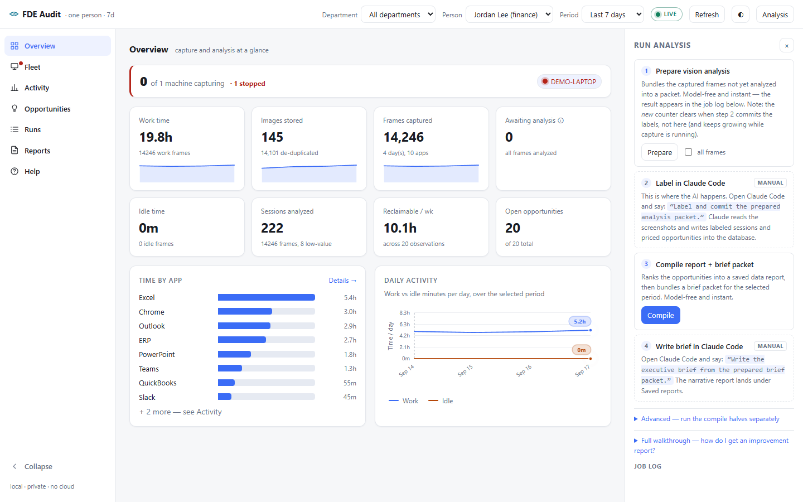
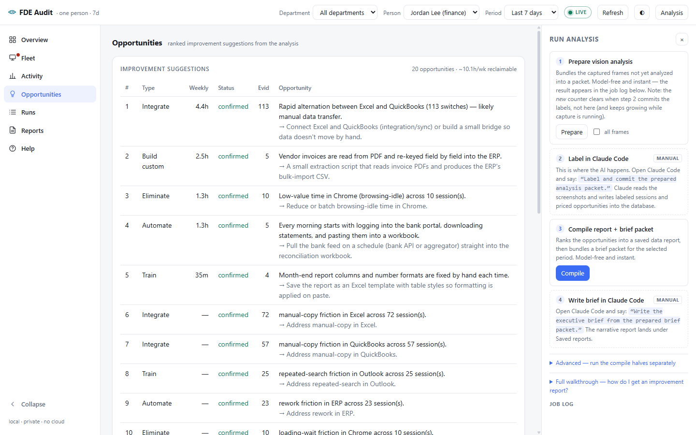
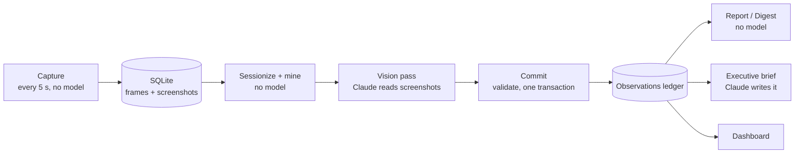

# FDE Audit


**It watches how people actually work on their computers and turns that into a ranked, priced list of what to automate, integrate, consolidate, or stop doing.**

A forward deployed engineer's first week at a client could include shadowing people and noticing things: the report rebuilt by hand every Monday, the data copied between two apps all day, three tools doing the same job. FDE Audit does that shadowing automatically. It captures screen activity during work sessions, finds the repeated low-value patterns, and has Claude read the screenshots to work out what would fix each one and how many hours a week it costs.

Built by **[Alex at Leveled AI](https://leveledai.com)**.



---

## What it produces

A ledger of **typed, priced opportunities**, each backed by evidence from real sessions:

| Type | What it means | Example |
|---|---|---|
| `integrate` | Two systems kept in sync by hand | 113 switches between Excel and QuickBooks a week, likely manual data transfer |
| `automate` | A repeated manual sequence | Downloading bank statements every morning and pasting them into a workbook |
| `build-custom` | A small tool would collapse the work | Re-keying PDF invoices into the ERP field by field |
| `consolidate` | One job spread across several apps | Task tracking split across Asana and Trello, a license you could cut |
| `train` | The tool already does it faster | Fixing report formatting by hand instead of using a template |
| `eliminate` | Low-value time | Idle browsing across ten sessions |

These are rolled up by person and department, ranked by weekly time cost, and turned into a Markdown digest. Claude can also write an executive brief on top of them for a manager to read.



## How it works



The rule behind the whole design: **only the analysis step costs money, and only where it's needed.**

1. **Capture (no model, no API key).** Every 5 seconds a small Python loop records the foreground app, window title, idle time, and a screenshot. A perceptual hash drops near-duplicate screenshots, so a static screen writes metadata but no new image. Idle time collapses to a heartbeat. Reading without typing counts as *passive* work, not idle.
2. **Sessionize and mine (no model).** Frames are split into window-sessions whenever the app, title, or screen changes, the user goes idle, or 10 minutes pass. Transition mining then flags cheap hotspots: A-B-A-B app ping-pong (manual transfer), app sequences that repeat across days (automation candidates), and input density (data entry versus reading).
3. **Vision pass (Claude).** A packet of representative screenshots goes to Claude, which labels each session against a **controlled vocabulary** of ~20 capabilities and adds typed opportunities for whatever it sees, including problems inside a single app like unused hotkeys or manual formatting.
4. **Commit (deterministic).** Every label is validated against the taxonomy, then written in **one transaction**. A single bad label rolls back the entire run, so a failed pass leaves nothing half-written. Observations are priced in minutes per week from real frame spans and flip to *confirmed* once they repeat enough.
5. **Report, digest, dashboard (no model).** Ranking, rollups, and Markdown formatting over the ledger. When you accept or dismiss an opportunity, that decision survives later re-analysis.

A few things I'm happy with:

- **The controlled vocabulary is the point.** Free-text labels can't be grouped across people. Because every session is tagged from the same closed set of capabilities, "task tracking is split across three apps in two departments" becomes a `GROUP BY`, and that's where the license-cut findings come from.
- **Claude never writes SQL.** It fills in structured fields in a packet, and a small, strict CLI validates and inserts them. A confused model can't damage the database.
- **Privacy is built in.** Password managers and anything with "banking", "sign in" or "credit card" in the title are recorded as metadata only, never screenshotted. Screenshots stay on the machine and are pruned after 14 days, while the text insights are kept.
- **Ready for rollout from the start.** Every table carries `person_id` and `device_id`, the schema only uses SQL that ports to Postgres, and capture can auto-enroll a machine's department from Active Directory. Going from one user to a company is a backend swap, not a rewrite. See [docs/DISTRIBUTION.md](docs/DISTRIBUTION.md).

## Quick start

Requires **Python 3.12+**. Capture is **Windows-only** for now (it reads the foreground window and idle time through Win32).

```bash
git clone https://github.com/alexleveled/fde-workflow-audit.git
cd fde-workflow-audit
python -m venv .venv
.venv\Scripts\activate            # macOS/Linux: source .venv/bin/activate
pip install -e ".[dashboard]"
```

### Try it with demo data (no recording needed)

```bash
python scripts/seed_demo.py
fde_audit --config demo/config.toml dashboard
```

Then open http://127.0.0.1:8787. The seeder makes five workdays of synthetic activity for a fictional finance analyst (about 17,000 frames) and runs the **real** analysis pipeline over them. The only thing faked is the vision step: the labels come from a fixed table instead of Claude reading screenshots. That's the data in the screenshots above.

### Record your own work

```bash
fde_audit db init
fde_audit person add --name "Your Name" --dept developer
fde_audit capture start                 # Ctrl+C to stop
```

Pause at any time by creating a file named `PAUSE` in `digest_data/`. For always-on capture, `fde_audit capture install-task` registers a Windows logon task that restarts on failure.

### Analyze it

```bash
fde_audit analyze prepare               # sessionize, mine, write a vision packet
```

Then in [Claude Code](https://claude.com/claude-code), from the repo folder:

> Label and commit the prepared analysis packet.

Claude reads the screenshots, fills in each session's labels and any opportunities it spots, and runs `fde_audit analyze commit`. After that:

```bash
fde_audit report                        # ranked opportunities in the terminal
fde_audit digest generate --out digest.md
fde_audit dashboard                     # the web UI
```

The vision step goes through Claude Code, so it runs on a Claude subscription and needs no API key. It could also be done with a direct API call, which is the better choice for unattended rollout across many machines. [docs/DISTRIBUTION.md](docs/DISTRIBUTION.md) compares both.

Full command reference: **[docs/USAGE.md](docs/USAGE.md)**.

## Configuration

All settings are in [`config.toml`](config.toml): capture interval, idle thresholds, dedupe sensitivity, session-splitting rules, mining thresholds, privacy denylists, retention, and an optional `loaded_hourly_rate` that turns weekly hours into dollars in the digest.

## Project layout

```
config.toml                 every tunable in one place
src/fde_audit/
  capture/                  the 5 s loop, screenshot + perceptual hash, privacy denylist
  platform/windows.py       ctypes: foreground window, idle time, DPI, monitors, mutex
  analysis/                 taxonomy, sessionize, mining, prepare (packet), commit (1 txn)
  reporting.py              ranked opportunity report + consolidation view
  digest.py                 Markdown digest, no model
  brief.py                  executive brief packet in, narrative Markdown out
  monitor.py                capture liveness across machines
  enroll.py                 Active Directory department auto-enrollment
  dashboard/                FastAPI app + one self-contained HTML page
  db/                       portable schema, migrations, data access
scripts/seed_demo.py        demo workspace generator
tests/                      unittest suite over a deterministic synthetic scenario
docs/                       usage reference, rollout options, explainer page
```

## Tests

```bash
python -m unittest            # or: python -m pytest -q
```

44 tests cover sessionization, mining, the commit transaction and rollback, reporting, digests, the executive brief, enrollment, and capture liveness.

## Tech stack

Python 3.12+ · SQLite (Postgres-portable schema) · mss · Pillow · ctypes / Win32 · FastAPI · uvicorn · Claude (vision + narrative) via Claude Code

## About the author

I'm Alex, a CPA-turned software developer and AI integrator. I build AI systems that fit into how a business already runs.

- Website: **[leveledai.com](https://leveledai.com)**
- More work: [github.com/alexleveled](https://github.com/alexleveled)

Want to know where your team's hours are going? [Get in touch through leveledai.com](https://leveledai.com).

## License

[MIT](LICENSE)
